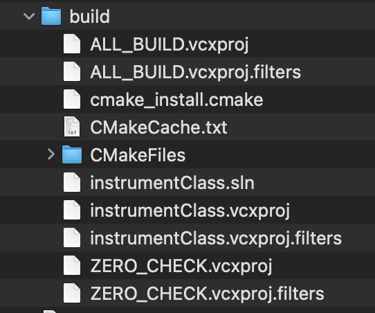
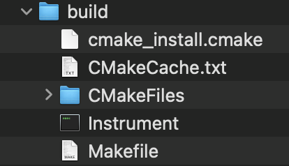
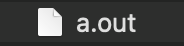
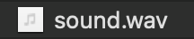
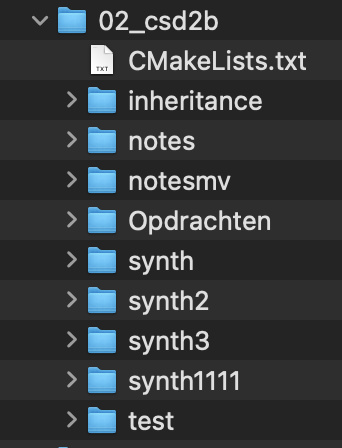

# Clean Your Repos!

## Wat ik niet wil zien >:- ()
### Build files <br> 

### Executables <br>
 <br>

### audio files <br>

### moeilijk te vinden eindopdracht <br>

### .DS_Store


## Gebruik een .gitignore

```.gitignore
# extensions
*.wav 
*.jpg

# folders
# specifieke map in de root folder
/map1       
# elke map met de deze naam
map3/       

# build folders 
build/
cmake-build-debug/

# IDE 
.idea
.vscode

# OS-generated
.DS_Store

# cmake 
CMakeCache.txt
cmake_install.cmake
```

## N.B.
Als je deze dingen al in je repository hebt staan, moet je ze verwijderen voordat je een .gitignore aanmaakt, <br>
anders kan negeert git je bestand tijdens de `rm` opdracht. 

## Handige Tool
[.gitignore generator](https://www.toptal.com/developers/gitignore)
